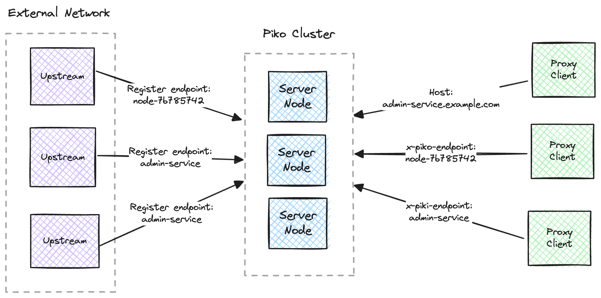

# archiveproject

## Queue Service

  * PGMQ - Postgres 기반의 SQS 대체제 (https://github.com/tembo-io/pgmq)
    * AWS SQS 및 RSMQ와 비슷한 경량 메시지 큐를 Postgres 기반으로 구현한 오픈소스
    * 백그라운드 워커 및 외부 의존성 없이, Postgres 확장으로만 구성
    * 제한시간 내에 컨슈머에게 '정확히 한번' 메시지 전달 보장
    * 메시지는 명시적으로 제거될 때 까지 대기열에 남아 있음
    * 메시지는 삭제 대신 아카이빙 하여 장기 보관 및 리플레이 가능
    * AWS SQS 및 RSMQ와 API 호환

## Reverse Proxy

  * Piko - Ngrok의 오픈소스 대체제 (https://github.com/andydunstall/piko)
    * 외부 네트워크로 터널링하는 리버스 프록시
    * 프로덕션 수준의 트래픽을 처리하며, 호스팅(특히 Kubernetes에서)이 간단하도록 설계됨
    * 고객 네트워크, BYOC(Bring Your Own Cloud) 서비스의 서비스를 노출하거나 IoT 디바이스에 연결할 수 있음
    * 내결함성, 확장성, 무중단 배포를 위해 노드 클러스터로 호스팅될 수 있음
    * 
    * [Docker-compose.yaml](./example/docker-compose-pico.yaml)
